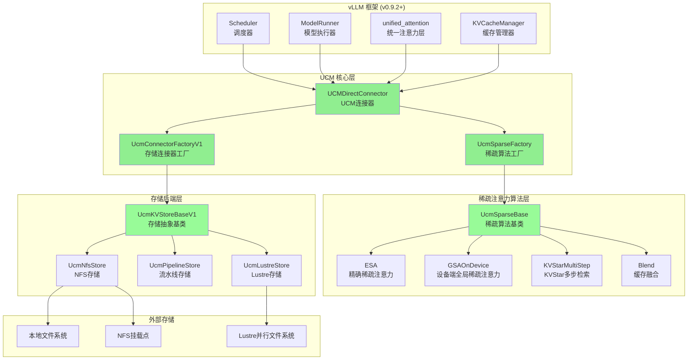
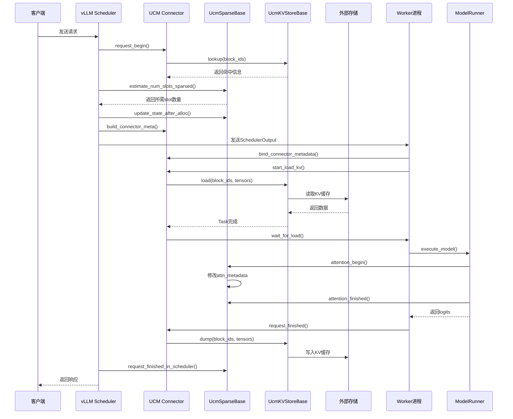
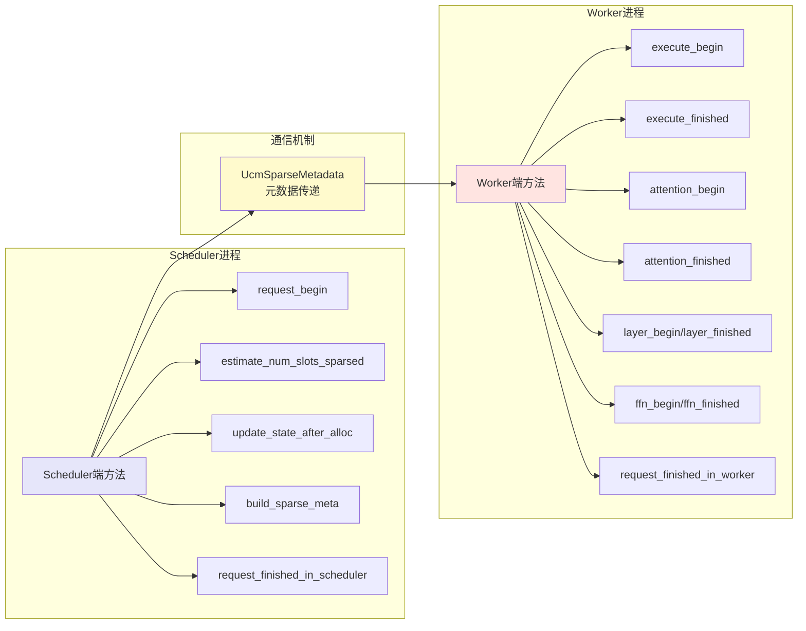
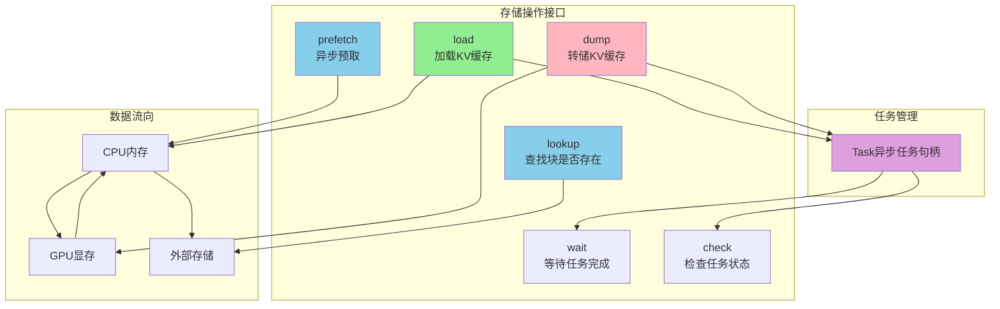
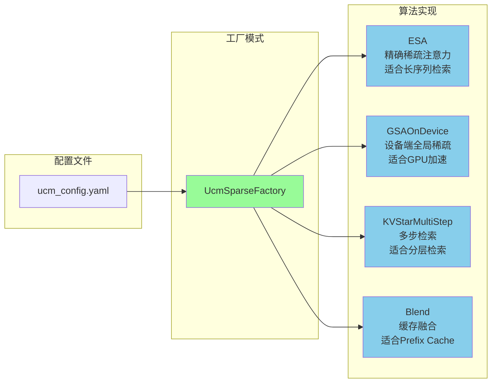
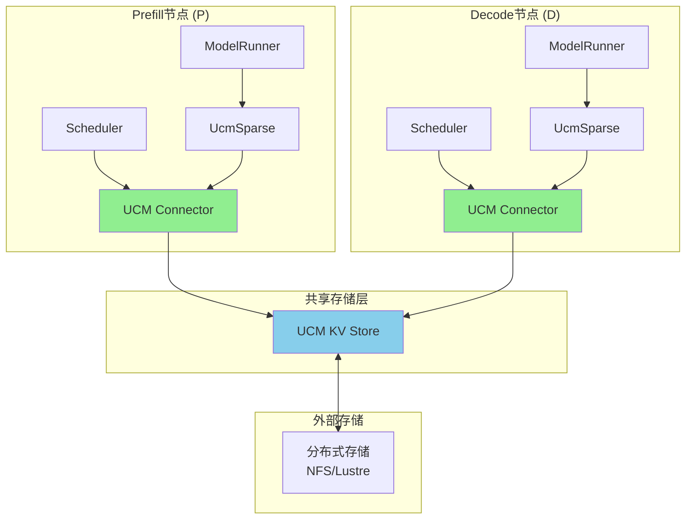
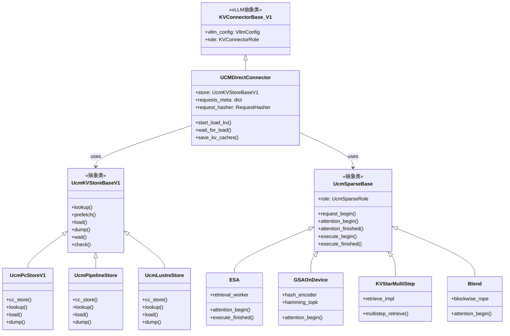
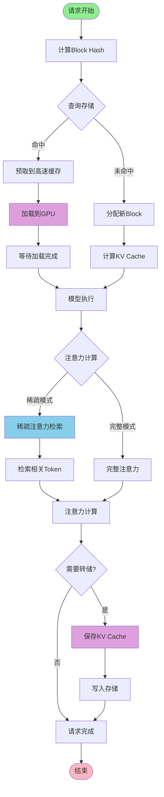

# UCM 整体框架流程图

## 1. 系统架构总览

## 2. 请求处理流程

## 3. UcmSparseBase 双端架构

## 4. 存储层操作流程

## 5. 稀疏注意力算法选择

## 6. PD分离架构

## 7. 核心类继承关系

## 8. 数据流详细流程

## 关键组件说明

### 1. UCMDirectConnector
- **作用**: 连接vLLM框架与UCM系统的桥梁
- **职责**: 
  - 管理请求元数据
  - 协调KV缓存的加载和转储
  - 与存储后端交互

### 2. UcmSparseBase
- **作用**: 稀疏注意力算法的抽象基类
- **设计模式**: 模板方法模式
- **双端设计**:
  - Scheduler端: 负责调度决策和资源估算
  - Worker端: 负责实际的KV缓存操作和注意力计算

### 3. UcmKVStoreBaseV1
- **作用**: 存储后端的统一抽象接口
- **核心方法**:
  - `lookup`: 查询块是否存在
  - `load/dump`: 异步数据传输
  - `wait/check`: 任务同步

### 4. 工厂类
- **UcmSparseFactory**: 根据配置创建稀疏算法实例
- **UcmConnectorFactoryV1**: 根据配置创建存储连接器实例
