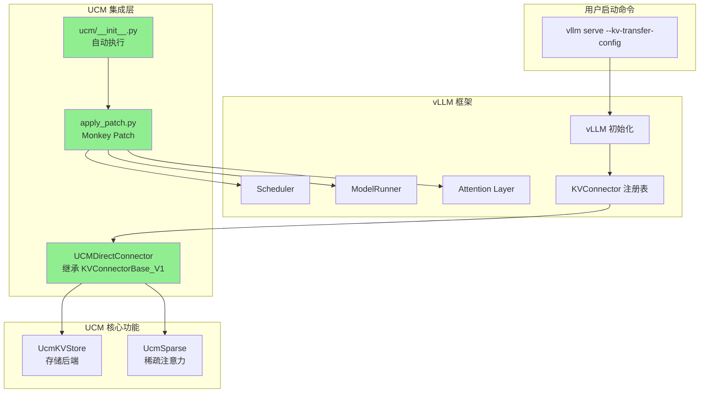
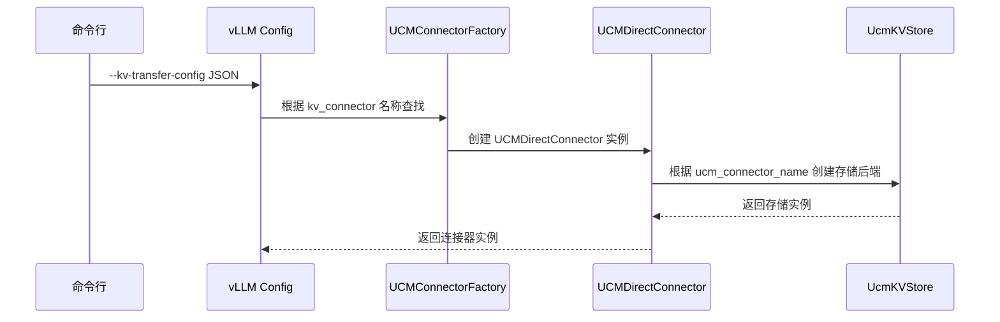
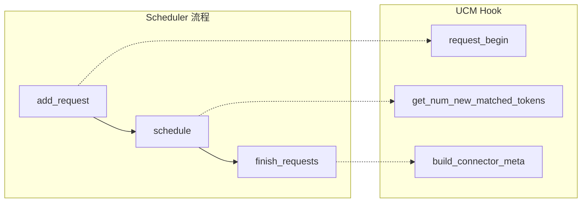
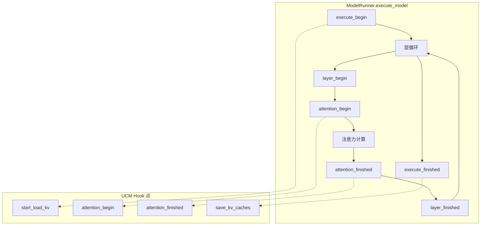
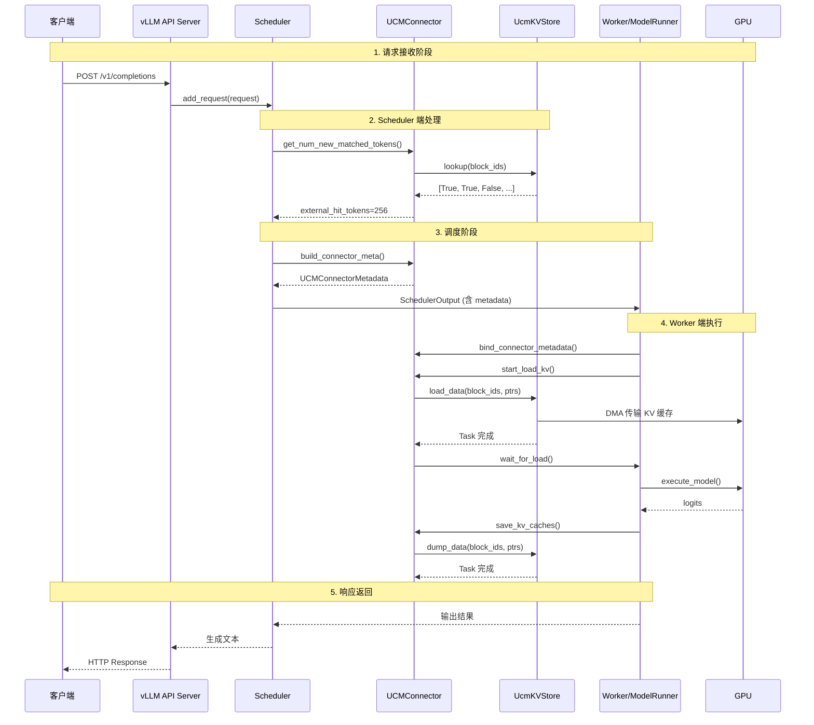
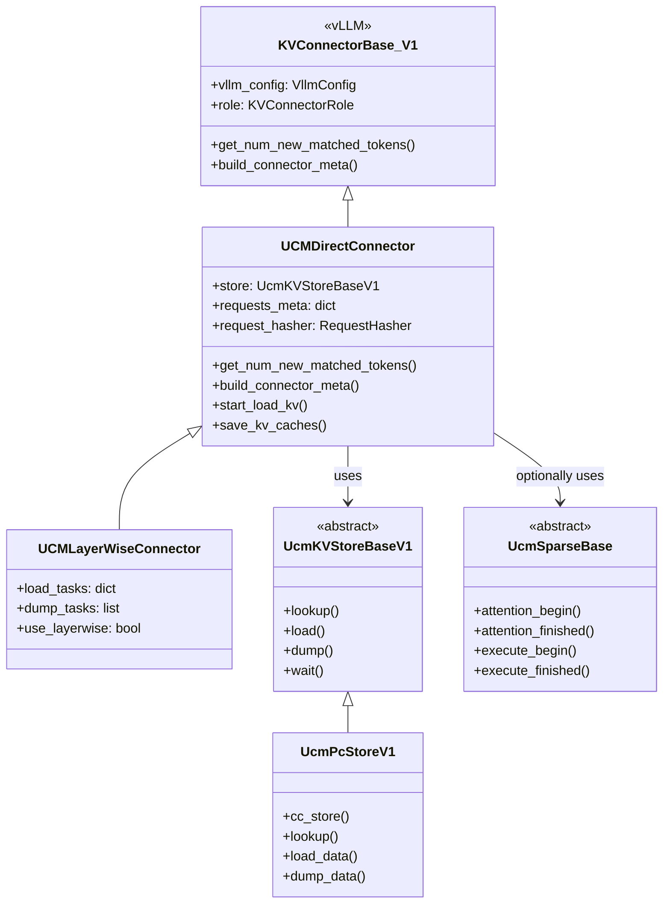
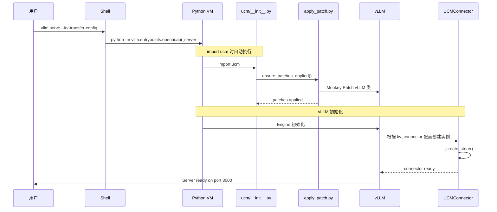

# UCM 与 vLLM 集成机制详解

## 1. 集成架构概览



## 2. 三种集成方式

### 方式一：继承 vLLM 基类

UCM 的 [`UCMDirectConnector`](../../ucm/integration/vllm/ucm_connector.py:82) 继承自 vLLM 的 `KVConnectorBase_V1`：

```python
# ucm/integration/vllm/ucm_connector.py
from vllm.distributed.kv_transfer.kv_connector.v1.base import (
    KVConnectorBase_V1,
    KVConnectorMetadata,
    KVConnectorRole,
)

class UCMDirectConnector(KVConnectorBase_V1):
    """
    This connector means synchronize:
    load -> forward -> save
    """
    def __init__(self, vllm_config: "VllmConfig", role: KVConnectorRole):
        super().__init__(vllm_config=vllm_config, role=role)
        # UCM 特有初始化
        self.store: UcmKVStoreBaseV1  # 存储后端
        ...
```

### 方式二：Monkey Patching

通过 [`apply_patch.py`](../../ucm/integration/vllm/patch/apply_patch.py) 动态修改 vLLM 的行为：

```python
# ucm/__init__.py - 自动执行
try:
    from ucm.integration.vllm.patch.apply_patch import (
        ensure_patches_applied,
        get_vllm_version,
    )
    if get_vllm_version() == "0.11.0":
        ensure_patches_applied()  # 应用所有 patch
except Exception as e:
    warnings.warn(f"Failed to apply vLLM patches: {e}")
```

**Patch 的主要内容：**

| Patch 目标 | 文件 | 作用 |
|-----------|------|------|
| SchedulerOutput | [`vllm_patch.py`](../../ucm/integration/vllm/patch/patch_funcs/v092/vllm_patch.py:79) | 添加 `kv_connector_metadata` 字段 |
| Attention Layer | [`vllm_patch.py`](../../ucm/integration/vllm/patch/patch_funcs/v092/vllm_patch.py:141) | 注入 `attention_begin/finished` hook |
| ModelRunner | [`vllm_patch.py`](../../ucm/integration/vllm/patch/patch_funcs/v092/vllm_patch.py) | 注入 `execute_begin/finished` hook |
| Scheduler | [`vllm_patch.py`](../../ucm/integration/vllm/patch/patch_funcs/v092/vllm_patch.py) | 注入调度决策 hook |

### 方式三：配置注入

通过 `--kv-transfer-config` 参数将 UCM 配置传入 vLLM：

```bash
vllm serve /path/to/model \
    --kv-transfer-config '{
        "kv_connector": "UCMConnector",
        "kv_connector_module_path": "ucm.integration.vllm.ucm_connector",
        "kv_role": "kv_producer",
        "kv_connector_extra_config": {
            "ucm_connector_name": "UcmNfsStore",
            "ucm_connector_config": {
                "storage_backends": "/mnt/nfs",
                "transferStreamNumber": 32
            }
        }
    }'
```

**配置解析流程：**



## 3. Hook 注入点详解

### 3.1 Scheduler 端 Hook



**代码示例：**

```python
# vLLM Scheduler 原始代码被 patch 后
def add_request(self, request):
    # UCM Hook: 计算外部存储命中
    if self.kv_connector:
        external_tokens, _ = self.kv_connector.get_num_new_matched_tokens(
            request, num_computed_tokens
        )
    # 原始逻辑...
```

### 3.2 Worker 端 Hook



**Attention Layer Patch 示例：**

```python
# ucm/integration/vllm/patch/patch_funcs/v092/vllm_patch.py
def attn_forward(self, query, key, value, output_shape=None):
    # UCM Hook: attention_begin
    if has_ucm_sparse():
        ucm_sparse = get_ucm_sparse()
        query, key, value, output = ucm_sparse.attention_begin(
            query, key, value, layer_name, forward_context
        )

    # 原始注意力计算
    output = unified_attention_with_output(...)

    # UCM Hook: attention_finished
    if has_ucm_sparse():
        ucm_sparse.attention_finished(query, key, value, output, ...)

    return output
```

## 4. 数据流完整流程



## 5. 关键类关系图



## 6. 启动流程时序



## 7. 总结

UCM 与 vLLM 的集成通过三个层次实现：

| 层次 | 机制 | 作用 |
|------|------|------|
| **配置层** | `--kv-transfer-config` | 声明式指定 UCM 组件 |
| **继承层** | `KVConnectorBase_V1` | 实现 vLLM 定义的接口 |
| **Patch层** | Monkey Patching | 在关键路径注入 UCM 逻辑 |

这种设计使得 UCM 能够：
1. **非侵入式集成**：不需要修改 vLLM 源码
2. **灵活配置**：通过配置文件选择不同的存储后端和稀疏算法
3. **版本兼容**：针对不同 vLLM 版本提供不同的 patch
